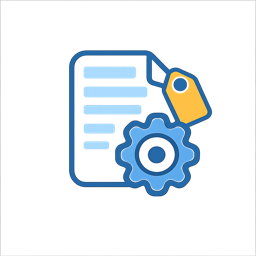

<p align="center">
  
</p>

# Paperless Metadata Manager

A web-based tool for bulk metadata management in [Paperless-ngx](https://github.com/paperless-ngx/paperless-ngx). Clean up unused tags, correspondents, and document types, merge similar items, and maintain a tidy document management system.

[](LICENSE)
[](https://www.python.org/)
[](https://github.com/benhumphry/paperless-metadata-manager/releases)
[](https://github.com/benhumphry/paperless-metadata-manager/pkgs/container/paperless-metadata-manager)

## Features

- **📊 Metadata Overview**: View all tags, correspondents, and document types with document counts
- **🧹 Cleanup**: Identify and bulk-delete items with zero or few documents
- **🔀 Smart Merge**: Auto-suggest similar items for merging based on:
  - **Prefix matching** `.*` - Groups items starting with the same word (e.g., "account-personal", "account-business")
  - **Spelling similarity** `~` - Groups items with similar spelling using Levenshtein distance (catches typos)
  - **Semantic similarity** `≈` - Groups items with related meanings using word associations (e.g., "invoice" and "bill")
  - **AI grouping** `⚡` - Optional LLM-powered grouping using OpenAI, Anthropic, or Ollama
- **⚡ Fast**: Client-side grouping for instant filtering and responsive UI
- **🔒 Safe**: Confirmation dialogs for all destructive operations
- **🐳 Docker Ready**: Simple deployment with Docker Compose

## Screenshots

*Coming soon*

## Quick Start

### 1. Get your Paperless-ngx API Token

In Paperless-ngx, go to **Settings → Administration → API Tokens** and create a new token.

Alternatively, create one via CLI:
```bash
docker exec paperless python manage.py generate_api_token <username>
```

### 2. Run with Docker

```bash
docker run -d \
  --name paperless-metadata-manager \
  -p 8080:8000 \
  -e PAPERLESS_URL=http://your-paperless-url:8000 \
  -e PAPERLESS_API_TOKEN=your_api_token_here \
  --restart unless-stopped \
  ghcr.io/benhumphry/paperless-metadata-manager:latest
```

Access the web UI at **http://localhost:8080**

### Alternative: Docker Compose

Create a `docker-compose.yml`:

```yaml
services:
  paperless-metadata-manager:
    image: ghcr.io/benhumphry/paperless-metadata-manager:latest
    environment:
      - PAPERLESS_URL=http://your-paperless-url:8000
      - PAPERLESS_API_TOKEN=your_api_token_here
    ports:
      - "8080:8000"
    restart: unless-stopped
```

Then run:
```bash
docker compose up -d
```

## Configuration

All configuration is via environment variables (set in `.env` file):

| Variable | Required | Default | Description |
|----------|----------|---------|-------------|
| `PAPERLESS_URL` | ✅ | - | Base URL of your Paperless-ngx instance |
| `PAPERLESS_API_TOKEN` | ✅ | - | API token for authentication |
| `PORT` | ❌ | `8000` | Port for the web UI |
| `LOG_LEVEL` | ❌ | `info` | Logging level (debug, info, warning, error) |
| `EXCLUDE_PATTERNS` | ❌ | `new,inbox,todo,review` | Comma-separated list of tag patterns to exclude from cleanup suggestions |
| `LLM_TYPE` | ❌ | - | LLM provider: `openai`, `anthropic`, or `ollama` |
| `LLM_API_URL` | ❌ | varies | API URL (required for Ollama, optional for others) |
| `LLM_API_TOKEN` | ❌ | - | API token (required for OpenAI/Anthropic) |
| `LLM_MODEL` | ❌ | varies | Model name (e.g., `gpt-5-mini`, `claude-3-haiku-20240307`, `llama3`) |

### Exclude Patterns

The `EXCLUDE_PATTERNS` setting allows you to protect important tags from being suggested for deletion, even if they have few documents. This is useful for:
- Workflow tags (new, inbox, todo, review)
- Project tags you want to keep empty
- Placeholder tags for future use

**Examples:**
```bash
# Simple patterns (case-insensitive substring match)
EXCLUDE_PATTERNS=new,inbox,todo,review

# Regex patterns for more control
EXCLUDE_PATTERNS=^important.*,^keep-.*,archived-\d+

# Mixed patterns
EXCLUDE_PATTERNS=new,inbox,^project-.*,review,^archive-
```

## Usage

### Metadata Type Selector

Choose from Tags, Correspondents, or Document Types using the dropdown at the top.

### All Tab

View all items with:
- Document count (color-coded: red=0, green=1+)
- Match type (None, Any, All, Literal, Regex, Fuzzy, Auto)
- Tag color preview (for tags only)

Click column headers to sort. Filter by name using the search box.

### Cleanup Tab

Find items that are candidates for deletion:
- Filter by maximum document count (0, 1, 2, or 5)
- Toggle "Exclude auto-match" to show/hide auto-matching items
- Auto-excludes items matching configured patterns (tags only)
- Select individual items or use "Select All"
- Bulk delete with confirmation

### Merge Tab

Consolidate similar items with intelligent grouping:

**Suggestion Groups:**
- Groups are displayed alphabetically with a type indicator:
  - `.*` (blue) = Prefix match - items sharing a common starting word
  - `~` (green) = Spelling similarity - items with similar spelling (Levenshtein distance)
  - `≈` (purple) = Semantic similarity - items with related meanings (word associations)
  - `⚡` (amber) = AI suggested - LLM-powered grouping (requires LLM configuration)
- Items can appear in multiple groups if they match multiple criteria
- Use the checkboxes to enable/disable each grouping type

**AI Grouping (Optional):**
- Configure `LLM_TYPE` and `LLM_API_TOKEN` to enable the "⚡ AI Group" button
- Supports OpenAI, Anthropic, and local Ollama models
- Sends all item names to the LLM in a single request for intelligent grouping
- Great for finding semantic relationships the other methods might miss

**How to Merge:**
1. Click "Find Suggestions" to load all items and compute groups
2. Click on suggestion groups to add all items to selection
3. Or use custom search to find specific items
4. Click individual items to add/remove from selection
5. Enter target name and click "Merge Selected"

**Live Filtering:**
- Type in the prefix filter box for instant filtering (no server round-trip)
- Groups are recomputed client-side as you type

**The merge process:**
1. Creates the target item (if it doesn't exist)
2. Reassigns all documents to the target
3. Deletes the source items
4. Automatically refreshes suggestions to reflect the changes

## Deployment Options

### Same Network as Paperless-ngx

If Paperless-ngx is running in Docker, connect to the same network for internal communication:

```yaml
services:
  paperless-metadata-manager:
    image: ghcr.io/benhumphry/paperless-metadata-manager:latest
    environment:
      - PAPERLESS_URL=http://paperless:8000
      - PAPERLESS_API_TOKEN=your_api_token_here
    ports:
      - "8080:8000"
    networks:
      - paperless_default
    restart: unless-stopped

networks:
  paperless_default:
    external: true
```

Replace `paperless` with your Paperless-ngx container name.

### Behind a Reverse Proxy

The app runs on port 8000 by default. Configure your reverse proxy (nginx, Caddy, Traefik, etc.) to proxy to this port. No special headers are required.

### Building from Source

If you prefer to build locally:

```bash
git clone https://github.com/benhumphry/paperless-metadata-manager.git
cd paperless-metadata-manager
docker build -t paperless-metadata-manager .
```

## Development

### Prerequisites

- Python 3.12+
- pip

### Local Setup

```bash
# Create virtual environment
python -m venv venv
source venv/bin/activate  # or `venv\Scripts\activate` on Windows

# Install dependencies
pip install -r requirements.txt

# Copy and configure .env
cp example.env .env
nano .env

# Run development server
uvicorn app.main:app --reload --port 8000
```

### Project Structure

```
paperless-metadata-manager/
├── app/
│   ├── __init__.py
│   ├── main.py              # FastAPI application
│   ├── config.py            # Settings from environment
│   ├── paperless_client.py  # Async Paperless API client
│   ├── routers/
│   │   ├── health.py        # Health check endpoints
│   │   └── tags.py          # Tag management endpoints
│   ├── templates/
│   │   ├── base.html        # Base template
│   │   └── index.html       # Main UI
│   └── static/
│       └── js/
├── tests/
├── Dockerfile
├── docker-compose.yml
├── requirements.txt
├── example.env
└── README.md
```

## API Endpoints

| Endpoint | Method | Description |
|----------|--------|-------------|
| `/` | GET | Web UI |
| `/health` | GET | Basic health check |
| `/health/full` | GET | Health check with Paperless connection test |
| `/api/tags` | GET | List all tags |
| `/api/tags/low-usage` | GET | List low-usage tags |
| `/api/tags/all` | GET | Get all tags (for client-side processing) |
| `/api/tags/delete` | POST | Delete tags |
| `/api/tags/merge/preview` | POST | Preview merge operation |
| `/api/tags/merge` | POST | Execute merge operation |

## Future Enhancements

### Custom Field Value Management

Support for managing custom field values is planned for a future release. Unlike tags, correspondents, and document types (which are standalone entities), custom fields work differently in Paperless-ngx:

**Challenges:**
- Custom field **values** are stored on documents, not as separate entities
- There's no API endpoint to list all unique values for a custom field
- Aggregating values requires scanning all documents (performance impact)
- Only "select" type fields have discrete, mergeable values
- API format for select options changed in Paperless-ngx API v7+

**Planned Approach:**
- Support only "select" type custom fields initially
- Build a value aggregation layer that scans documents
- Use the `bulk_edit` API with `modify_custom_fields` for merging values
- Implement "merge" as reassigning documents from one value to another

## Contributing

Contributions are welcome! Please:

1. Fork the repository
2. Create a feature branch (`git checkout -b feature/amazing-feature`)
3. Commit your changes (`git commit -m 'Add amazing feature'`)
4. Push to the branch (`git push origin feature/amazing-feature`)
5. Open a Pull Request

## License

This project is licensed under the MIT License - see the [LICENSE](LICENSE) file for details.

## Acknowledgments

- [Paperless-ngx](https://github.com/paperless-ngx/paperless-ngx) - The amazing document management system
- [FastAPI](https://fastapi.tiangolo.com/) - Modern Python web framework
- [HTMX](https://htmx.org/) - High power tools for HTML
- [Alpine.js](https://alpinejs.dev/) - Lightweight JavaScript framework
- [Tailwind CSS](https://tailwindcss.com/) - Utility-first CSS framework
